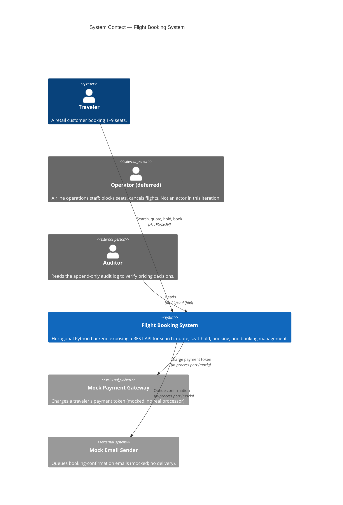
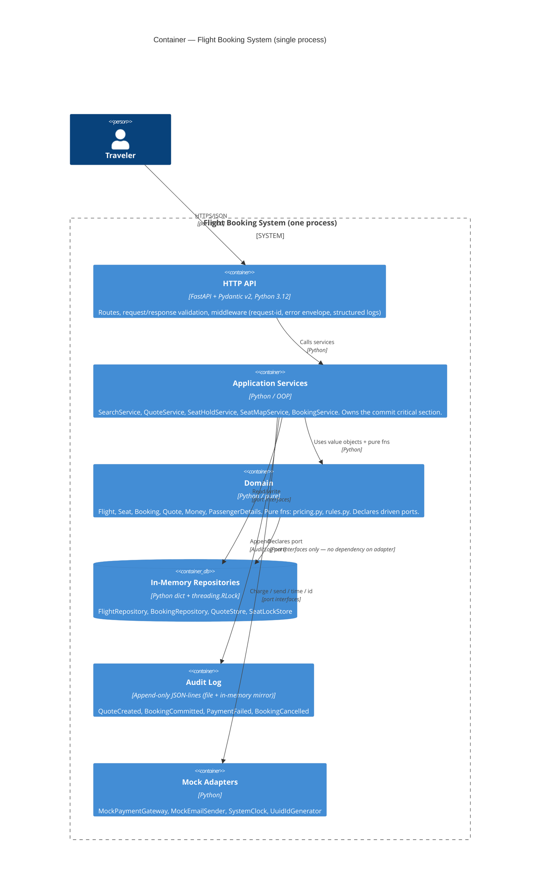
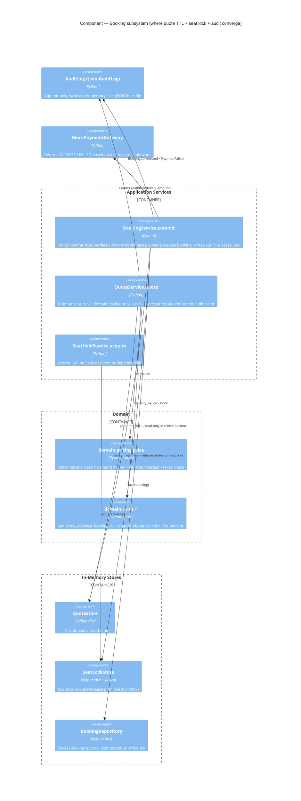
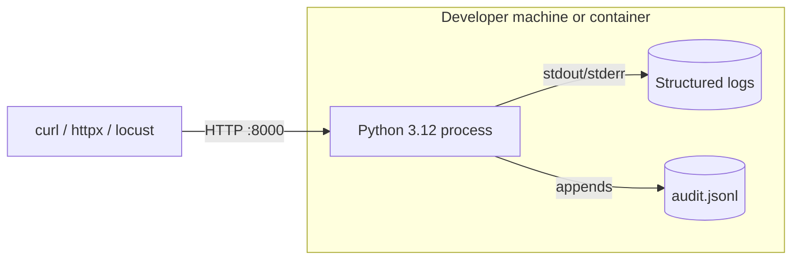

# C4 Diagrams — flight-booking-system

Mermaid-rendered C4 views. Levels 1 (System Context) and 2 (Container) are mandatory per DESIGN wave. Level 3 (Component) is included for the Booking subsystem because it houses the trust contract (ADR-006 + ADR-008).

---

## Level 1 — System Context

**Notes**
- The operator is drawn as external/deferred — no endpoint this iteration (ADR-007).
- Payment and email are *in-process* mocks accessed via ports — shown as external systems for protocol clarity (they will become real external systems in later iterations without domain change).
- Auditor is an offline actor; they read the audit log file, not an API.

---

## Level 2 — Container

**Notes**
- Domain declares ports; repositories/adapters implement them. Arrow goes from `app → repos` because services call ports; domain "owns" the interfaces but doesn't call them.
- All containers run in the **same OS process** — no IPC, no network between containers. Boundaries are Python module boundaries.

---

## Level 3 — Component (Booking subsystem — the trust contract)

**Notes**
- `BookingService.commit` reads `quote.total` from `QuoteStore` — **never recomputes price**. This is the structural guarantee behind KPI-T1.
- `auditlog.append(QuoteCreated(...))` is inside the same critical section as the price computation in `QuoteService`, guaranteeing "every quote has an audit record" (KPI-T3).
- `SeatHoldService` runs outside the commit critical section; its own store lock handles concurrent acquires (ADR-008, "Property 1").

---

## Deployment view (informative)

Single container/process:

No external services. `audit.jsonl` path is configurable via env var (default `./audit.jsonl`).
